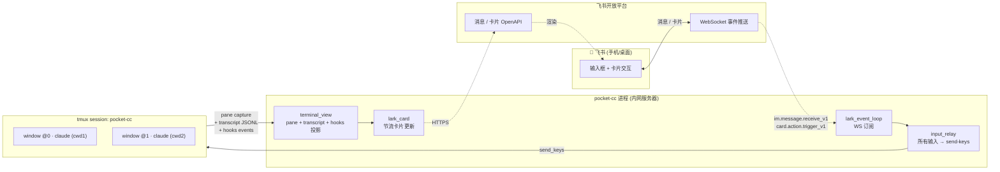

# pocket-cc — 飞书客户端遥控内网 Claude Code

> 目标：在手机飞书上获得**接近 Claude Code 官方 remote 模式**的体验 —— 远程终端里 Claude Code 实际跑什么、长什么样、当前在做什么，飞书界面就如实呈现什么。用户不需要学任何新命令。

---

## 1. 目标与非目标

### 核心目标
- **终端镜像 (Terminal Mirror)**：飞书侧呈现的是远程终端里 Claude Code 的**实际运行情况**，不是简化封装
- **零学习成本**：用户不学任何 pocket-cc 专属命令；Claude Code 原生的一切（斜杠命令、`/clear` `/compact` `/cost` `/agents` `/model` `/permissions` …、自定义 slash command、skill、plan mode、ask user question、permission prompt）都按 Claude Code 自己的语义工作
- **内网友好**：内网服务器**不需要公网 IP、端口映射、HTTPS 证书**；出网即可（飞书 WS 长连接）
- **桌面/手机双向接入**：服务器上 `tmux attach` 随时接回去，飞书侧和桌面侧看到的是同一个会话

### 阶段性目标 (Phase 2, 团队)
- 多用户白名单，每用户独立 workspace
- 群聊 `@bot` 触发，话题群一会话一话题
- 文件回传（Claude 写出的产物下载到手机）

### 非目标
- **不发明 bot 命令**（没有 `/new` `/sessions` `/switch` 这种 pocket-cc 专属命令）
- **不依赖 ccgram 代码**（参考思路，但完全自研一份；不引入 ccgram 作为依赖/子模块）
- 不做 Claude API 直接调用（坚持 CLI + tmux，保持终端是 source of truth）
- 不复刻 ccgram 的所有花活（live view、voice、mini app、inter-agent messaging 都不做）

---

## 2. 核心设计哲学 — 终端是 Source of Truth

```
真实 tmux pane 里 Claude Code 跑成什么样     ←─ 唯一权威
                  ↓
         飞书界面只是它的投影
```

**所有用户输入都是 `tmux send-keys`**，包括：
- 普通文本任务描述 → 直接发到 Claude Code 的输入框
- `/clear` `/compact` `/cost` `/agents` `/model` `/permissions` 等斜杠命令 → 原样 send-keys，让 Claude Code 自己处理
- 用户自定义 slash command、skill 触发词 → 也是原样透传
- 特殊按键（Esc 退出 plan、Shift+Tab 切 mode、Tab、回车）→ 通过卡片按钮发对应 tmux key

**所有飞书侧呈现都是从 pane / transcript / hook 事件解析出来的**：
- 普通文本 / thinking：来自 transcript JSONL 增量
- 工具调用 + 结果：transcript 的 `tool_use` / `tool_result` 配对
- Plan mode 的方案预览：来自 transcript 的 `plan` payload
- AskUserQuestion 的选项：来自 transcript / pane 解析，**用户在飞书选项 ≈ 在终端按方向键 + 回车**
- Permission 询问：同理，飞书呈现按钮，按钮就是终端按键
- TUI 状态行（"📝 Writing tests..."）：pyte 解析 pane 文字 + Claude hooks 事件
- 完成 / 失败：来自 Claude Code 的 Stop / StopFailure hook

**好处**：
1. 不需要重新发明任何 UX；Claude Code 出什么新功能，pocket-cc 自动跟上（只要 transcript / pane / hook 能看到）
2. 桌面用户和手机用户共享同一个会话状态
3. 用户认知模型简单 —— "我在跟 Claude Code 对话"，不是"我在用 pocket-cc"

---

## 3. 架构总览



---

## 4. 自研模块清单（参考 ccgram 思路）

ccgram 不作为依赖，只作为参考实现。下表标注每个模块我们要自研，并注明能从 ccgram 哪里借鉴思路。

### 4.1 飞书适配层（全新自研）
| 模块 | 职责 | 备注 |
|---|---|---|
| `lark/client.py` | `LarkClient` Protocol + `LarkOapiClient`（封装 `lark-oapi` SDK） + `FakeLarkClient`（测试） | 类比 ccgram `telegram_client.py` 的 Protocol 思路 |
| `lark/event_loop.py` | WS 长连接订阅 `im.message.receive_v1`、`card.action.trigger_v1`，分发事件 | 飞书独有 |
| `lark/card.py` | 飞书交互卡片构造器（运行中 / Plan / AskUser / Permission / 完成 / 失败 卡片模板） | 飞书独有 |
| `lark/card_throttle.py` | 卡片 PATCH 节流（min 1.5s/次，hash 去重，pending merge） | 飞书独有 |
| `lark/keys.py` | 飞书按钮 → tmux 按键序列映射（Esc/Shift-Tab/Tab/Enter/Ctrl-C…） | 飞书独有 |

### 4.2 终端层（自研，参考 ccgram）
| 模块 | 职责 | 参考 ccgram |
|---|---|---|
| `tmux/manager.py` | tmux window 创建 / send_keys / capture_pane / list_panes / kill | `tmux_manager.py` |
| `tmux/session.py` | 服务进程级 tmux session 管理（确保 `pocket-cc` session 存在） | 部分思路 |
| `terminal/screen_buffer.py` | pyte VT100 解析 pane 文本 | `screen_buffer.py` |
| `terminal/parser.py` | TUI 元素识别（spinner、模式行、AskUserQuestion 菜单、Permission 框） | `terminal_parser.py` |

### 4.3 Claude Code 集成层（自研，参考 ccgram）
| 模块 | 职责 | 参考 ccgram |
|---|---|---|
| `claude/hooks.py` | 注册 SessionStart / Stop / StopFailure / Notification / SessionEnd 到 `~/.claude/settings.json`；hook 脚本写入 `events.jsonl` | `hook.py` + `hooks/` |
| `claude/transcript.py` | 增量读 JSONL（byte offset），解析 message / tool_use / tool_result / thinking / plan / ask_user | `transcript_parser.py` |
| `claude/session_index.py` | window_id ↔ session_id 双向索引（从 hook events 维护） | `session_map.py` |
| `claude/monitor.py` | 后台任务：合并 hooks 事件 + transcript 增量 → 投影更新流 | `session_monitor.py` |
| `claude/state.py` | 每个 window 的运行状态（active / working / waiting_user / done / failed） | `claude_task_state.py` |

### 4.4 投影/转发层（自研）
| 模块 | 职责 | 参考 ccgram |
|---|---|---|
| `relay/input.py` | 飞书消息 / 卡片按钮 → tmux send-keys；任何文本（含斜杠）原样透传 | `handlers/text/`（但简化） |
| `relay/output.py` | transcript / hooks / pane 解析事件 → 飞书卡片更新 | `message_routing.py` + `tool_batch.py` |
| `relay/card_stream.py` | 单会话的"运行中卡片"生命周期（创建 → 节流 patch → 完成态收尾 → 新建下一张） | `tool_batch.py` 思路 |
| `relay/queue.py` | per-chat FIFO 队列 + 节流，避免触发飞书频控 | `message_queue.py` 思路 |
| `relay/interactive.py` | AskUserQuestion / Permission / Plan 等需要回复的交互 → 卡片按钮 → 按键 | 简化版的 ccgram interactive |

### 4.5 应用层（自研）
| 模块 | 职责 |
|---|---|
| `app/bootstrap.py` | 启动 tmux session、安装 hooks、起 WS、起 monitor、注入 client |
| `app/config.py` | 配置加载（APP_ID/SECRET、白名单 open_id、workspace 列表、节流参数） |
| `app/persistence.py` | 状态持久化（chat_id ↔ window_id 绑定、活跃 session、卡片 message_id） |
| `cli.py` | `pocket-cc run / doctor / hook --install / hook --uninstall` |

### 4.6 测试
- 单测：注入 `FakeLarkClient` + `FakeTmux`，断言事件 → send-keys / patch_card 调用
- 集成测：真 tmux + 真 Claude Code，模拟手机消息，验收 transcript 投影
- 不依赖飞书 mock 服务器（飞书没有官方 mock），HTTP 用录制回放

---

## 5. 关键技术决策

### 5.1 输入层：全部透传，零命令路由
- 用户文本（含 `/...` 开头）→ 一律 `send_keys + Enter`
- pocket-cc **不**截胡任何斜杠命令（除非未来必须，如 `/pcc-status` 这种纯查询）
- 特殊按键通过**卡片按钮**发送，按钮 → tmux key：
  - `[ Esc ]` → `Escape`（退出 plan / 取消 prompt）
  - `[ ⇧⭾ Mode ]` → `BTab` (Shift-Tab)
  - `[ ⭾ Think ]` → `Tab`
  - `[ ⏎ Enter ]` → `Enter`
  - `[ ⏹ 中断 ]` → `C-c`
  - `[ 📜 内容 ]` → 抓 pane 文本附在卡片折叠区
- 飞书侧呈现的"输入框"就是用户认知里的"Claude 输入框"，等价

### 5.2 输出层：分层投影
事件源有三个，按优先级合并：
1. **Claude hooks events.jsonl**（最快、最权威）：SessionStart / Stop / StopFailure / Notification / SessionEnd
2. **transcript JSONL 增量**（内容主体）：text / thinking / tool_use / tool_result / plan / ask_user_question
3. **pane capture (pyte)**（fallback + TUI 元素）：spinner、模式行、AskUserQuestion 菜单、Permission 提示

合并策略：
- transcript 主导内容流（什么文本、什么工具调用、思考链）
- hooks 主导状态切换（开始 / 结束 / 错误 / 等用户输入）
- pane 兜底未在 transcript 出现的 TUI 元素（如 plan mode 的可视化框）

### 5.3 一张卡片 = 一个回合
- 用户每次发消息 → 创建一张新卡片（"运行中" 状态）
- 卡片头部：`🤖 Claude · <状态>`，状态从 hooks 实时更新
- 卡片主体：节流刷新内容（文本 + 工具调用摘要 + 可折叠详情）
- 卡片底部：行动按钮（Esc / Shift-Tab / Tab / Enter / C-c / 抓 pane）
- 单卡片到达 ~3000 字符或检测到 Stop → 收尾卡片，下一回合开新卡片
- 节流 1.5s/次（飞书 PATCH 限频 ~5 QPS，留余量），hash 去重

### 5.4 交互式 UX 映射
Claude Code 这几类原生交互特别需要适配，目标都是「等价于用户在终端的操作」：

| Claude Code UX | 飞书侧呈现 | 用户操作的等价按键 |
|---|---|---|
| AskUserQuestion（多选项） | 卡片附按钮列表，每个选项一个按钮 | 方向键定位 + Enter |
| ExitPlanMode（plan 预览 + 确认） | 卡片显示 plan 内容 + `[ 接受 ]` `[ 修改 ]` `[ 取消 ]` | y / n / Esc |
| Permission prompt（允许工具调用） | 卡片显示工具名 + `[ 允许 ]` `[ 拒绝 ]` `[ 一直允许 ]` | 对应按键 |
| 文本输入框 | 飞书消息直接发文本 | 直接键入 |

实现路径：transcript 出现 `ask_user_question` / `plan` payload 时，渲染对应卡片；用户点按钮 → `card.action.trigger_v1` → 翻译成 tmux key 序列 send 进去。

### 5.5 会话绑定（MVP 单聊）
- key = `chat_id` (飞书 P2P chat 稳定)
- 1 个 chat 默认绑 1 个 tmux window（自动管理，不让用户操心）
- 用户在 chat 内说话 = 跟 active window 对话
- 切目录 / 新会话：Phase 2 通过卡片菜单（不是文本命令）；MVP 启动时配置默认 workspace 即可

### 5.6 权限模式
MVP：
- 启动 Claude 时 `--permission-mode default`（让 Claude 该问就问；问的时候我们在飞书侧渲染 permission 卡片）
- 工作目录限制：每个 chat / 用户绑定到 `~/.pocket-cc/workspaces.toml` 里允许的目录之一
- 用户白名单：飞书 `open_id` 白名单

可选（用户偏好）：
- `bypassPermissions` 模式（信任工作目录的话）
- `plan` 模式默认开（更安全，所有改动先有方案）

### 5.7 LarkClient Protocol（草案）
```python
class LarkClient(Protocol):
    async def send_text(chat_id: str, text: str, reply_to: str | None = None) -> str
    async def send_card(chat_id: str, card: dict, reply_to: str | None = None) -> str
    async def patch_card(message_id: str, card: dict) -> None
    async def add_reaction(message_id: str, emoji: str) -> None
    async def delete_message(message_id: str) -> None
    async def get_chat_info(chat_id: str) -> dict
    async def upload_file(file_path: str) -> str  # Phase 2
    async def download_file(message_id: str, file_key: str) -> bytes  # Phase 2
```

---

## 6. 数据流

### 6.1 入站：用户发消息
```
飞书 用户输入任意文本（"加日志"  /  "/clear"  /  "y"）
  ↓ WS event im.message.receive_v1
event_loop 解析 (chat_id, open_id, text)
  ↓ 白名单 / chat 绑定校验
relay/input.send_text_to_active(chat_id, text)
  ↓ resolve chat_id → window_id
tmux/manager.send_keys(window_id, text + Enter)
  ↓ Claude Code 收到
[创建/复用] 当前回合的"运行中卡片" message_id（若不存在则发新卡片）
```

### 6.2 入站：用户点卡片按钮
```
飞书 点 [ Esc ] 按钮
  ↓ WS event card.action.trigger_v1
event_loop 解析 (message_id, action_payload={"key": "Escape"})
  ↓ resolve message_id → window_id
tmux/manager.send_keys(window_id, "Escape")  # 不带 Enter
```

### 6.3 出站：Claude 输出 → 飞书卡片
```
Claude 写 transcript JSONL  +  hooks 写 events.jsonl
  ↓
claude/monitor 后台 (2s tick)
  ↓ 合并三路事件（hooks 优先级最高）
  ↓ 生成 ProjectionUpdate（状态 / 文本 / 工具调用 / ask_user / plan / done）
relay/output.dispatch(window_id, update)
  ↓ 入 per-chat 队列
relay/card_stream 累计到当前回合卡片 buffer
  ↓ throttle 1.5s
lark_client.patch_card(current_card_id, rendered_card)
```

### 6.4 完成态
```
Claude Stop hook 写 events.jsonl
hook_events.handle_stop 触发
  ↓ 立刻 flush 当前 buffer（绕过 throttle）
  ↓ 卡片头改 ✅ Done / ❌ Failed
  ↓ 按钮区改成 [ 续聊 ] [ 中断 ]（如果 Stop reason 是 user-action 才显示）
  ↓ 当前回合卡片封板，下一条用户消息开新卡片
```

---

## 7. 飞书 API 验证清单

M0 阶段必须各跑一次 hello world：

| 能力 | API | 验证点 |
|---|---|---|
| WS 长连接 | `lark-oapi` Python SDK `ws.Client` | 内网能否稳定 30+ min 不掉线 |
| 收消息 event | `im.message.receive_v1` | message_id、富文本格式 |
| 收卡片回调 event | `card.action.trigger_v1` | payload 字段、延迟 |
| 发文本 | `POST /im/v1/messages` (msg_type=text) | reply_in_thread 参数 |
| 发交互卡片 | `POST /im/v1/messages` (msg_type=interactive) | 卡片 JSON 上限 |
| 卡片 PATCH | `PATCH /im/v1/messages/:message_id` | QPS、可 patch 次数 |
| 文件上传 (Phase 2) | `POST /im/v1/files/upload_all` | 大小限制 |
| 用户身份 | `open_id` from event | 是否需要 contact API 反查 |

预估约束（M0 实测确认）：
- 卡片 PATCH ~5 QPS/tenant，1.5s 节流足够
- 卡片建议 < 30KB
- WS 心跳 25-30s（SDK 内置）

---

## 8. 工具链与项目结构

### 8.1 工具链
- **包管理 / 虚拟环境 / 锁文件**：[uv](https://github.com/astral-sh/uv)（**唯一**包管理器，不混用 pip/poetry/pdm）
- **Python**：3.11+（与 `lark-oapi` 兼容；3.12 优先）
- **构建后端**：`hatchling`（uv 默认推荐）
- **格式 / lint / typecheck**：`ruff`（fmt + lint） + `mypy`（typecheck）
- **测试**：`pytest` + `pytest-asyncio`
- **依赖核心**：`lark-oapi`（飞书 SDK）、`libtmux` 或直接 subprocess 调 tmux、`pyte`（VT100 解析）、`structlog`（日志）、`click` 或 `typer`（CLI）

### 8.2 常用命令
```bash
uv init                              # 初始化项目（M0 第一步）
uv add lark-oapi pyte structlog click
uv add --dev ruff mypy pytest pytest-asyncio
uv sync                              # 安装依赖到 .venv
uv run pocket-cc run                 # 跑 bot
uv run pytest                        # 跑测试
uv run ruff format .
uv run ruff check .
uv run mypy pocket_cc
uv lock --upgrade                    # 升级锁文件
uv tool install -e .                 # 本地装 CLI（开发期）
```

`uv.lock` **必须提交**到仓库（保证多机/CI 环境一致）。

### 8.3 项目结构
```
pocket-cc/
├── pyproject.toml                   # uv 管理；含 [project]/[tool.ruff]/[tool.mypy]/[tool.pytest.ini_options]
├── uv.lock                          # 锁文件（提交）
├── .python-version                  # 由 uv 写入，固定 Python 版本
├── DESIGN.md                        # 本文档
├── README.md
├── Makefile                         # 可选，封装 uv run 常用命令
├── pocket_cc/
│   ├── __init__.py
│   ├── cli.py                       # pocket-cc run / doctor / hook（[project.scripts] 入口）
│   ├── app/
│   │   ├── bootstrap.py             # 启动编排
│   │   ├── config.py
│   │   └── persistence.py           # state.json (chat_id ↔ window_id, 卡片绑定)
│   ├── lark/
│   │   ├── client.py                # LarkClient Protocol + 实现 + Fake
│   │   ├── event_loop.py            # WS 订阅
│   │   ├── card.py                  # 卡片模板
│   │   ├── card_throttle.py
│   │   └── keys.py                  # 按钮 → tmux key 映射
│   ├── tmux/
│   │   ├── manager.py
│   │   └── session.py
│   ├── terminal/
│   │   ├── screen_buffer.py         # pyte
│   │   └── parser.py
│   ├── claude/
│   │   ├── hooks.py                 # 注册 + hook 脚本
│   │   ├── transcript.py
│   │   ├── session_index.py
│   │   ├── monitor.py
│   │   └── state.py
│   └── relay/
│       ├── input.py                 # 飞书 → tmux
│       ├── output.py                # claude → 飞书
│       ├── card_stream.py           # 回合卡片生命周期
│       ├── interactive.py           # AskUserQuestion / Plan / Permission
│       └── queue.py
└── tests/                           # 与源码平行（uv/pytest 默认布局）
    ├── unit/
    └── integration/
```

---

## 9. 分阶段 Milestone

### M0 — 调研验证 (1-2 天)
- [ ] 飞书自建应用申请，拿 APP_ID / APP_SECRET，开 bot + 卡片 + WS 能力
- [ ] `uv init` 起项目，`uv add lark-oapi`，写一个 50 行 `examples/hello_lark.py`
- [ ] `lark-oapi` Python SDK 跑通 WS 订阅 + 收消息 + 发文本 + 发卡片 + PATCH 卡片
- [ ] 跑通卡片按钮回调（card.action.trigger_v1）
- [ ] **验收**：手机发消息 → 收到 → 回一张可 patch 三次的卡片 → 点按钮 → 收到 payload

### M1 — 终端镜像 MVP (5-7 天)
- [ ] 项目骨架（`pocket_cc/` + pyproject）
- [ ] `lark/client.py` + Protocol + OAPI 适配 + Fake
- [ ] `tmux/manager.py`（send_keys / capture_pane / window 管理）
- [ ] `claude/hooks.py` + hook 脚本（写 events.jsonl）+ `pocket-cc hook --install`
- [ ] `claude/transcript.py`（增量读 JSONL，解析 text/tool_use/tool_result）
- [ ] `claude/monitor.py`（轮询合并 hooks + transcript）
- [ ] `relay/input.py`（**所有文本透传 send_keys**）
- [ ] `relay/output.py` + `relay/card_stream.py`（节流卡片更新）
- [ ] `lark/card.py`（运行中卡片模板：状态 + 文本 + 工具调用折叠 + 按钮）
- [ ] `app/bootstrap.py` + `cli.py`
- [ ] **验收**：手机发"实现 xxx 功能" → 看到 Claude 工作流式刷一张卡片；中途发 `/clear` 也能正常透传

### M2 — 交互式 UX (3-5 天)
- [ ] AskUserQuestion 渲染（选项按钮 → 翻译成方向键+Enter）
- [ ] ExitPlanMode 渲染（accept / modify / cancel）
- [ ] Permission prompt 渲染（allow / deny / always）
- [ ] 完成态 / 失败态卡片收尾
- [ ] 持久化 + 断电重启恢复

### M3 — 团队多人 (Phase 2)
- [ ] 多用户白名单 + 多 workspace
- [ ] 群聊 @bot 触发
- [ ] 话题群（可选，看飞书 API 能力）

### M4 — 进阶 (Phase 3)
- [ ] 文件回传（Claude 写出来的产物 → 飞书附件下载）
- [ ] 文件上传（飞书发图/文件 → 落到 workspace 让 Claude 读）
- [ ] 终端原始截图（pyte → PNG，用于排错）

---

## 10. 风险与未决问题

| 风险 | 影响 | 缓解 |
|---|---|---|
| 飞书卡片 PATCH 频控 | 流式体验差 | M0 实测确认参数 |
| 单卡片大小上限 | 长输出截断 | 多卡片接力；超大用文件 |
| AskUserQuestion / Plan / Permission 在 transcript 中的载体不稳定 | 交互式 UX 失效 | M1 先实现 transcript 路径，M2 加 pane fallback |
| Claude Code 版本升级改 transcript 格式 | 解析失败 | 解析层做版本嗅探 + 降级（落回 pane 文本） |
| WS 长连接断开 | 短时间失联 | SDK 自动重连 + 启动时补抓 events.jsonl |
| 内网服务器断电 | 会话状态丢失 | state.json 持久化 + tmux 自启 + 重启后从 events.jsonl 补帧 |

**未决问题**：
1. 内网服务器：固定一台？多台需要调度（先按单机假设）
2. 多 workspace 切换：M1 是否暴露？（倾向默认绑定一个，M2 才支持切）
3. Claude Code 的 `/clear` 之后 session_id 变化 → 卡片接力策略：跨 session 还是按物理回合切？
4. 飞书消息长度上限 vs Claude 长文本输入：超长需走文件

---

## 11. 与 ccgram 的关系（明确边界）

**ccgram 是参考，不是依赖。**

- ✅ 借鉴：tmux 路线、Claude hooks 用法、transcript 增量读策略、节流思路、Protocol-based 客户端解耦、状态机分层
- ❌ 不引入：不做 git submodule、不 vendored、不 import；ccgram 升级与我们无关
- 📚 当需要确认实现细节（比如 pyte 怎么解析、events.jsonl 字段、tool_use ↔ tool_result 配对），直接查 ccgram 源码作为参考实现，但是 pocket-cc 写自己的代码

每个模块在 §4 的表里都标注了"参考 ccgram 哪个模块"，作为实现时的对照。

---

## 12. 下一步

1. 你确认设计后，M0 开始：起 `pyproject.toml`、写最小 WS hello world 脚本、跑通飞书 5 个核心 API
2. M0 实测的数据（PATCH QPS、卡片大小、WS 稳定性）回填到 §5.3 的节流参数
3. M0 后开 M1 的 PR
